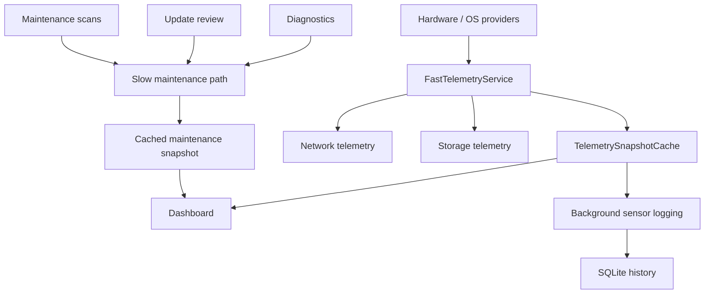

# EDITH Overdrive — Performance Cockpit

**Windows systems engineering · telemetria · concorrenza · performance**

[**English**](README.md) · **Italiano**

EDITH Overdrive è un performance cockpit per Windows 11 sviluppato all'interno di **EDITH Dev Studio**. La repository privata di sviluppo contiene l'applicazione completa; questa repository è un'edizione ingegneristica curata per revisione tecnica.

> Policy dello showcase pubblico: mostrare architettura, codice rappresentativo ed evidenze di verifica senza pubblicare configurazioni private, dati della macchina, materiale di pianificazione interna o il codice completo del prodotto.

## Problema ingegneristico

Uno strumento di monitoraggio può diventare parte del problema che sta misurando.

EDITH Overdrive tratta quindi **overhead a runtime, freschezza dei dati e degradazione controllata come requisiti architetturali**, non come rifiniture finali.

L'applicazione raccoglie dati eterogenei di sistema mantenendo le operazioni costose fuori dal percorso live della dashboard.

## Stack

- C# / .NET 8
- WinUI 3
- SQLite
- MVVM
- LibreHardwareMonitor
- PresentMon
- API di piattaforma Windows
- xUnit

## Architettura



Fast path e slow path sono volutamente isolati. Scansioni degli event log, package review e diagnostica pesante non vengono eseguiti a ogni refresh della dashboard.

## Decisioni ingegneristiche rappresentative

### Snapshot condivisi invece di polling duplicato

Dashboard e background logger possono riutilizzare lo stesso snapshot hardware grezzo. Un refresh gate basato su `SemaphoreSlim` impedisce che richieste simultanee di dati scaduti moltiplichino le chiamate costose ai provider.

### Semantica esplicita della freschezza

Consumatori diversi usano TTL differenti. Lo stato live della dashboard ha una finestra di freschezza breve; il logging in background può riutilizzare uno snapshot hardware leggermente più vecchio quando appropriato.

### Dati parziali come stato valido

Sensori non supportati o non disponibili vengono rappresentati come tali. Il resto dell'applicazione continua a funzionare invece di inventare valori o trattare un singolo provider mancante come failure globale.

### Performance guardrails

I test automatici coprono il riutilizzo della cache e altri invarianti legati al basso overhead, così da rilevare regressioni architetturali prima che diventino problemi visibili nella UI.

## Snapshot di verifica

La revisione della repository privata usata per questo showcase è:

```text
d677b1d998d3a6e1f3edd8acf656e98e0b1341f8
```

Quella revisione registra **201 test C# superati** dopo l'ultimo pass di hardening UI/lifecycle.

Le funzionalità specifiche di Windows vengono inoltre validate su Windows, perché WinUI, telemetria hardware, PresentMon e diverse integrazioni OS non possono essere dimostrate completamente in un ambiente neutrale rispetto alla piattaforma.

### Riferimento prestazionale locale

Una misurazione di sviluppo con refresh live predefinito e senza benchmark capture attivo ha riportato circa:

- CPU processo: **0,47% medio** su un breve campione idle post warm-up
- working set: **263,5 MB**
- private memory: **191,9 MB**

È una misura di riferimento, non un limite universale. Hardware, driver, cadenza di refresh e frame capture attivo possono modificare il risultato.

## Codice selezionato

La directory `samples/` contiene estratti rilevanti dal punto di vista architetturale:

- [FastTelemetryService.cs](samples/FastTelemetryService.cs) — serializzazione del refresh, TTL caching e riutilizzo snapshot
- [TelemetrySnapshotCache.cs](samples/TelemetrySnapshotCache.cs) — storage thread-safe degli snapshot condivisi
- [PerformanceGuardrailTests.cs](samples/PerformanceGuardrailTests.cs) — test di regressione per il riutilizzo della cache

Il progetto privato si chiamava inizialmente **SentinelPC**. Alcuni namespace nel codice selezionato mantengono ancora il nome legacy e vengono preservati intenzionalmente per mantenere gli estratti fedeli all'implementazione.

## Documentazione

- [Architecture](docs/ARCHITECTURE.md)
- [Verification and evidence](docs/VERIFICATION.md)
- [Source provenance](docs/SOURCE_PROVENANCE.md)
- [Public showcase scope](docs/PUBLIC_SCOPE.md)

## Link

- Engineering portfolio: https://github.com/Aceishere66/engineering-portfolio
- EDITH Dev Studio engineering page: https://edithdevstudio.com/engineering
