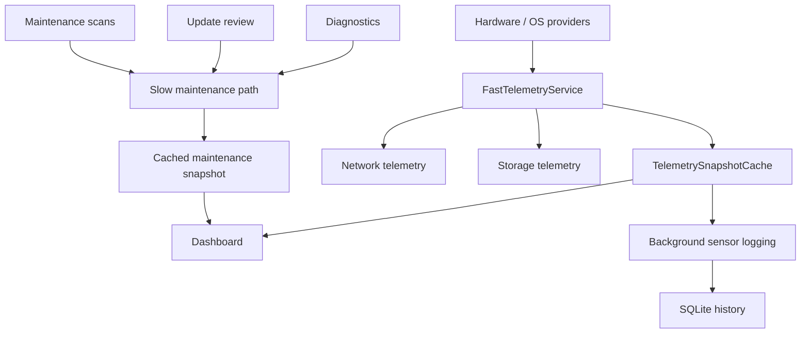

# EDITH Overdrive — Performance Cockpit

[**English**](README.md) · [Italiano](README.it.md)

**Windows systems engineering · telemetry · concurrency · performance**

EDITH Overdrive is a Windows 11 performance cockpit developed within **EDITH Dev Studio**. The private development repository contains the full application; this repository is a curated engineering edition for technical review.

> Public-showcase policy: expose architecture, representative source and verification evidence without publishing private configuration, machine data, internal planning material or the complete product source.

## Engineering problem

A monitoring tool can become part of the problem it is measuring.

EDITH Overdrive therefore treats **runtime overhead, data freshness and graceful degradation as architectural requirements**, not as polish added at the end.

The application collects heterogeneous system data while keeping expensive work out of the live dashboard path.

## Stack

- C# / .NET 8
- WinUI 3
- SQLite
- MVVM
- LibreHardwareMonitor
- PresentMon
- Windows platform APIs
- xUnit

## Architecture



The fast path and slow path are intentionally isolated. Event-log scans, package review and heavy diagnostics do not run on every dashboard refresh.

## Representative engineering decisions

### Shared snapshots instead of duplicate polling

The dashboard and background logger can reuse the same raw hardware snapshot. A `SemaphoreSlim` refresh gate prevents simultaneous stale-data requests from multiplying expensive provider calls.

### Explicit freshness semantics

Different consumers use different TTLs. Live dashboard state has a short freshness window; background logging can reuse a slightly older raw hardware snapshot when appropriate.

### Partial data is valid system state

Unsupported or unavailable sensors are represented as unavailable. The rest of the application remains functional instead of fabricating values or treating one missing provider as a global failure.

### Performance guardrails

Automated tests cover cache reuse and other low-overhead invariants so architectural regressions can be caught before becoming UI-visible performance problems.

## Verification snapshot

The current private-source snapshot used for this showcase is:

```text
d677b1d998d3a6e1f3edd8acf656e98e0b1341f8
```

That source revision records **201 passing C# tests** after its latest UI/lifecycle hardening pass.

Windows-specific functionality is additionally validated on Windows because WinUI, hardware telemetry, PresentMon and several OS integrations cannot be fully proven in a platform-neutral environment.

### Local performance reference

A development measurement with the default live dashboard refresh and no active benchmark capture reported approximately:

- process CPU: **0.47% average** over a short post-warm-up idle sample
- working set: **263.5 MB**
- private memory: **191.9 MB**

This is a reference measurement, not a universal ceiling. Hardware, drivers, refresh cadence and active frame capture can change the result.

## Selected source

The `samples/` directory contains architecture-relevant excerpts from the private codebase:

- [FastTelemetryService.cs](samples/FastTelemetryService.cs) — refresh serialization, TTL caching and snapshot reuse
- [TelemetrySnapshotCache.cs](samples/TelemetrySnapshotCache.cs) — thread-safe shared snapshot storage
- [PerformanceGuardrailTests.cs](samples/PerformanceGuardrailTests.cs) — regression tests protecting cache reuse

The private project was originally named **SentinelPC**. Some namespaces in the selected source still use the legacy name and are preserved intentionally so the excerpts remain faithful to the implementation.

## Documentation

- [Architecture](docs/ARCHITECTURE.md)
- [Verification and evidence](docs/VERIFICATION.md)
- [Source provenance](docs/SOURCE_PROVENANCE.md)
- [Public showcase scope](docs/PUBLIC_SCOPE.md)

## Links

- Engineering portfolio: https://github.com/Aceishere66/engineering-portfolio
- EDITH Dev Studio engineering page: https://edithdevstudio.com/engineering/
